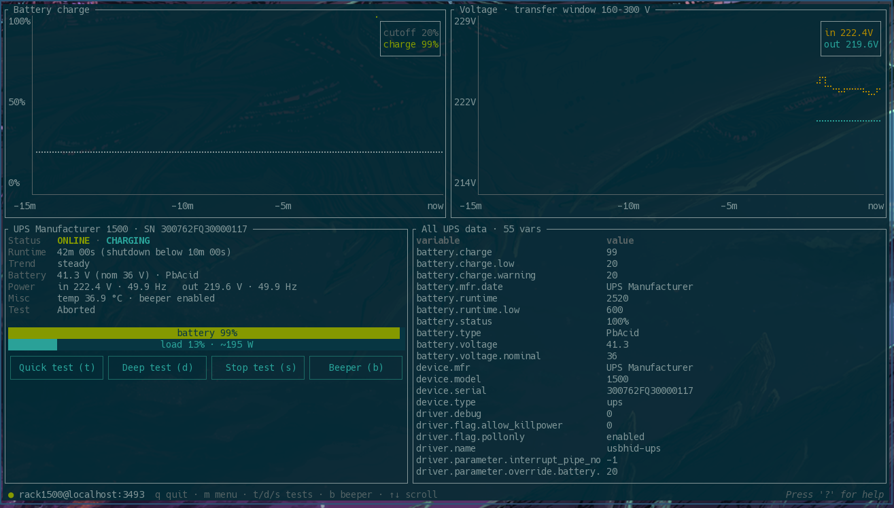

# nuttty

A [bottom](https://github.com/ClementTsang/bottom)-inspired terminal dashboard
for [Network UPS Tools](https://networkupstools.org/).



- Battery charge graph with the shutdown-cutoff line
- Input/output voltage graph with the transfer window in the title
- Runtime prediction from the UPS and from the observed charge trend
- Battery and load gauges (with estimated watts)
- Keyboard/mouse buttons for battery self-tests and the beeper, plus a
  menu of every instant command the UPS supports
- A scrollable table of every variable the UPS exposes

## Installation

On Arch-based systems, build and install the package with `makepkg`:

```
git clone https://github.com/MrSlopster/nuttty.git
cd nuttty
makepkg -si
```

Anywhere else with a Rust toolchain:

```
cargo install --git https://github.com/MrSlopster/nuttty
```

## Usage

```
nuttty                        # first UPS on localhost:3493
nuttty myups@nut-server:3493  # explicit UPS, host, and port
nuttty --once                 # dump all variables and exit
```

Instant commands (self-tests, beeper) need a NUT user with `instcmds`
granted in `upsd.users`; pass it via `--user`/`--password` or the
`NUTTTY_USER`/`NUTTTY_PASSWORD` (also `NUT_USER`/`NUT_PASSWORD`) environment
variables. Polling needs no credentials: `upsd` restricts reads by `LISTEN`
address, not by user.

## Configuration

Settings can also live in `$XDG_CONFIG_HOME/nuttty/config.toml`
(`~/.config/nuttty/config.toml` by default) as flat `key = "value"` pairs:

```toml
ups = "myups"
host = "localhost"
port = 3493
user = "upsadmin"
password = "secret"
interval = 2000
```

All keys are optional. Precedence: command line > environment > config file.

## Keys

| Key | Action |
|-----|--------|
| `q` / `Esc` | quit (or close an open popup) |
| `?` | help popup |
| `m` | command menu |
| `t` / `d` / `s` | quick test / deep test / stop test |
| `b` | toggle beeper |
| `↑` `↓` `PgUp` `PgDn`, `j` `k` | scroll variable table / menu |
| `g` / `G` | jump to top / bottom |
| `h` / `l` | close popup / run selected menu entry |

Buttons are also mouse-clickable. The command menu is populated from the
server (`LIST CMD` + `GET CMDDESC`), so it always matches your hardware.
Destructive commands (`load.off*`, `shutdown.*`, `driver.killpower`) are
shown in red and ask for a `y`/`N` confirmation before being sent.

## License

GPL-3.0-or-later — see [LICENSE](LICENSE).
